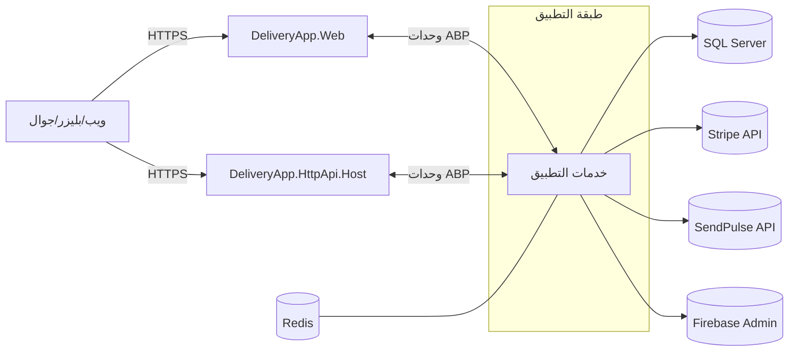
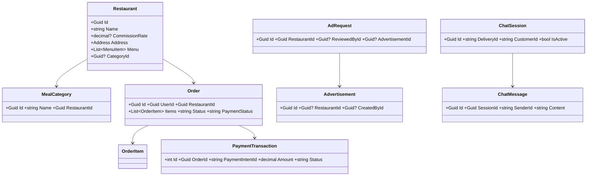
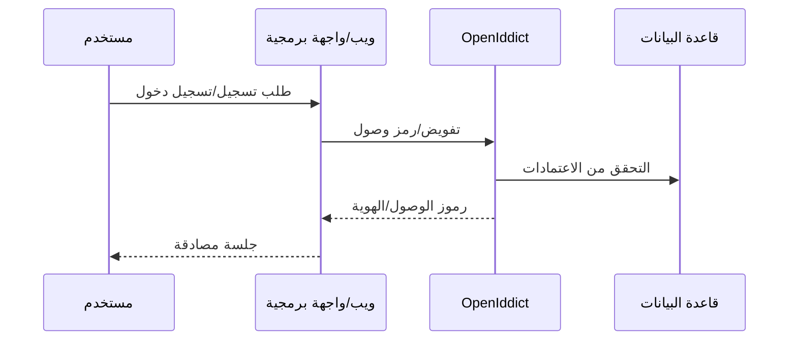
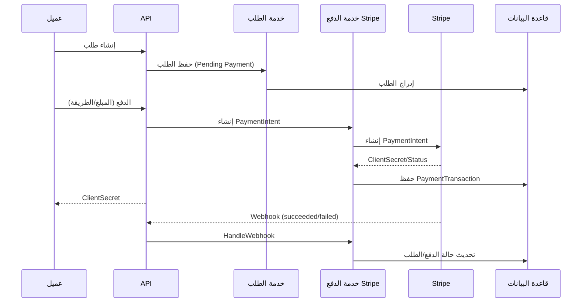
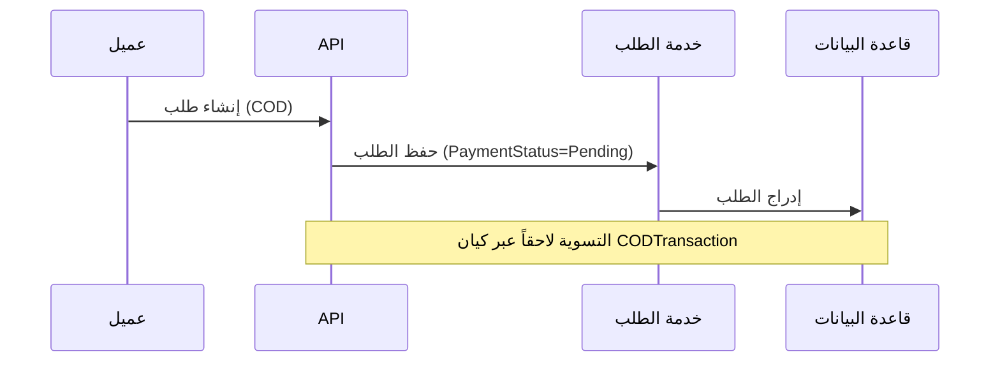
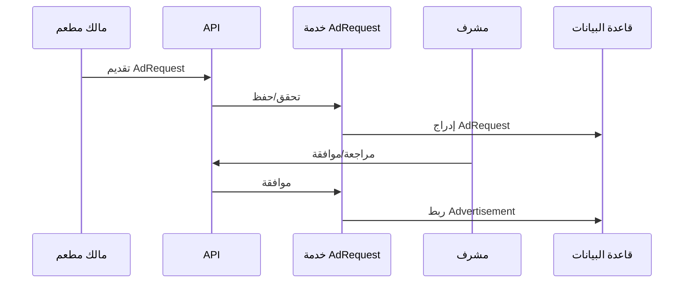
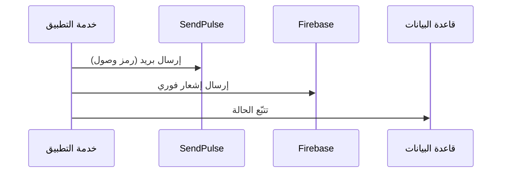

# المواصفات النظامية (العربية)

## 1) الهدف والنطاق
يوثّق هذا المستند متطلبات DeliveryApp الوظيفية وغير الوظيفية، وبنية النظام، ونموذج البيانات، والتكاملات، وتدفّقات التشغيل. الفئة المستهدفة: المهندسون ومالكو المنتج وأصحاب المصلحة.

## 2) المتطلبات الوظيفية
- إدارة المستخدمين: تسجيل/تسجيل دخول، أدوار (admin/manager/restaurant_owner/delivery/customer)، ملفات شخصية
- إدارة المطاعم: إنشاء/تحديث المطاعم، الفئات، القوائم، العروض الخاصة
- الطلبات: تصفّح القوائم، إنشاء طلب، إضافة عناصر/خيارات، تتبّع الحالة
- المدفوعات: بطاقات Stripe وحسابات متصلة/تحويلات؛ الدفع عند التسليم (COD)
- الإعلانات: طلبات إعلان من المالكين (AdRequest) ومراجعتها والموافقة عليها (Advertisement)
- الإشعارات: البريد (SendPulse) والدفعية (Firebase)
- الدردشة/الدعم: جلسات ورسائل بين الإدارة والعملاء/المندوبين
- التقارير: الأداء التشغيلي والمالي

## 3) متطلبات غير وظيفية
- الأمان: OIDC/OAuth2 عبر OpenIddict، تفويض بالأدوار، إدارة أسرار، HTTPS، سجلات تدقيق
- الأداء: قاعدة بيانات قابلة للتوسّع، وظائف خلفية، ذاكرة تخزين مؤقت (Redis اختياري)
- الاعتمادية: محاولات إعادة للاتصالات الخارجية، Webhooks عديمة الأثر، سجلات عبر Serilog
- المراقبة: سجلات منظّمة، نقاط صحّة (للإضافة)، Telemetry (للإضافة)

## 4) البنية العامة

## 5) نموذج المجال (مختصر)

## 6) التدفقات الرئيسية

### 6.1 التسجيل وتسجيل الدخول (OpenIddict)

### 6.2 إنشاء طلب والدفع (Stripe)

### 6.3 الدفع عند التسليم (COD)

### 6.4 سير عمل طلب الإعلان

### 6.5 الإشعارات (SendPulse/Firebase)

## 7) اصطلاحات الـ API
- REST ضمن `DeliveryApp.HttpApi` و`DeliveryApp.Web`
- التحكّم بالأدوار عبر السمات `[Authorize(Roles = ...)]`
- Webhook لStripe مع تحقق التوقيع

## 8) الإعدادات
- `appsettings.*.json` لكل مشروع وبيئة
- الأسرار عبر متغيرات البيئة أو مدير أسرار

## 9) النشر
- سكربتات Windows/IIS واستضافة مشتركة متوفرة
- استخدم DbMigrator للهجرات وتعبئة البيانات

## 10) المخاطر والضوابط
- تدوير الأسرار، التحقق من المُدخلات، تحديد المعدل لمحاولات تسجيل الدخول والدفع، تفعيل نقاط الصحّة
