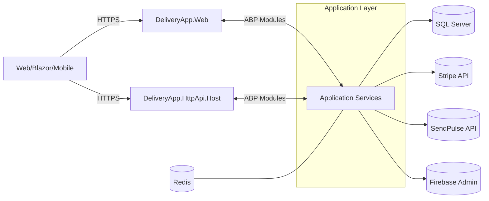
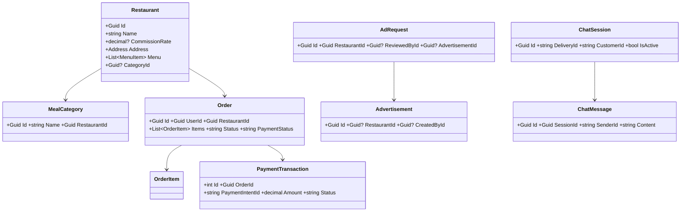
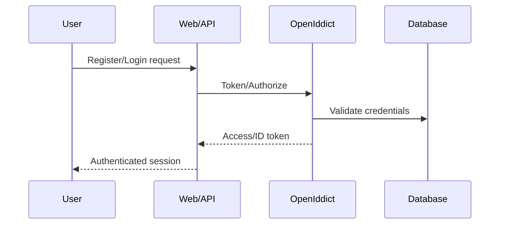
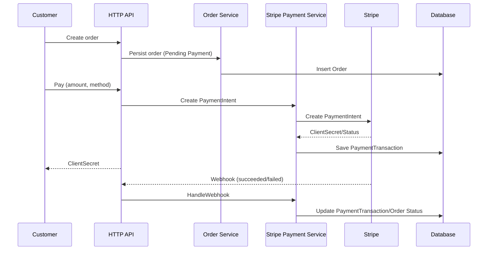
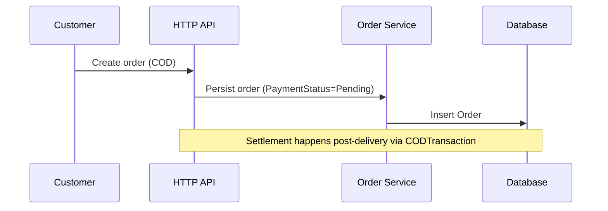
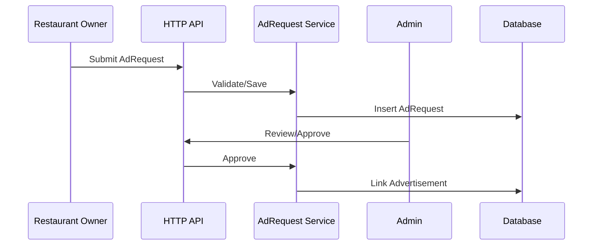
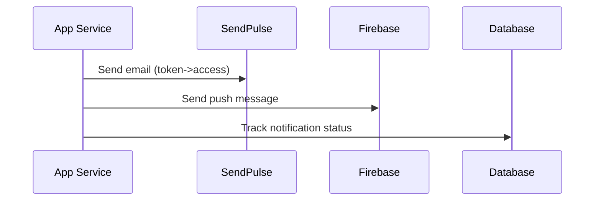

# System Specification (English)

## 1. Purpose and Scope
This document specifies DeliveryApp’s functional and non-functional requirements, architecture, data model, integrations, and runtime flows. It targets engineers, product owners, and stakeholders.

## 2. Functional Requirements
- User Management: register/login, roles (admin, manager, restaurant_owner, delivery, customer), profile management
- Restaurant Management: create/update restaurants, categories, menus, offers
- Ordering: browse menu, create order, add items/options, track status
- Payments: Stripe card payments, connected accounts/payouts; Cash on Delivery (COD)
- Advertising: owners submit AdRequests; admin reviews/approves; ads surface in feeds
- Notifications: email (SendPulse), push (Firebase); order and promo events
- Chat/Support: sessions and messages between admin and customers/delivery
- Reporting: delivery performance, financials, and restaurant analytics

## 3. Non-Functional Requirements
- Security: OIDC/OAuth2 via OpenIddict, RBAC, secret management, HTTPS, audit logs
- Performance: scalable DB, background jobs (ABP), caching (optional Redis)
- Reliability: retries for external calls, idempotent webhooks, logs via Serilog
- Observability: structured logs, health endpoints (to add), telemetry (to add)

## 4. High-Level Architecture


## 5. Domain Model (Key Aggregates)


## 6. Key Flows

### 6.1 Registration & Login (OpenIddict)


### 6.2 Place Order and Pay (Stripe)


### 6.3 Cash on Delivery (COD)


### 6.4 Ad Request Workflow


### 6.5 Notifications (SendPulse, Firebase)


## 7. API Conventions
- RESTful endpoints in `DeliveryApp.HttpApi` and `DeliveryApp.Web` controllers
- Versioning (add when needed); standard error shape; RBAC via attributes
- Webhook endpoint for Stripe with signature verification

## 8. Configuration
- appsettings per project and environment
- Secrets via environment variables or secret manager
- Connection strings in `ConnectionStrings:Default`

## 9. Deployment
- Windows/IIS and shared hosting scripts included (SmarterASP)
- Use DbMigrator for migrations and seeding

## 10. Risks and Controls
- Rotate secrets; validate inputs; rate limit login/payment endpoints; enable health checks
```
